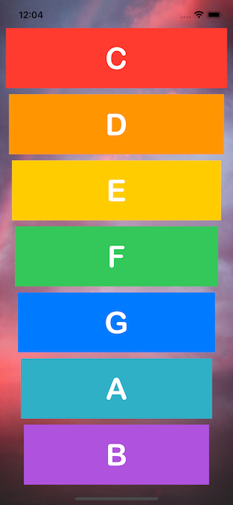
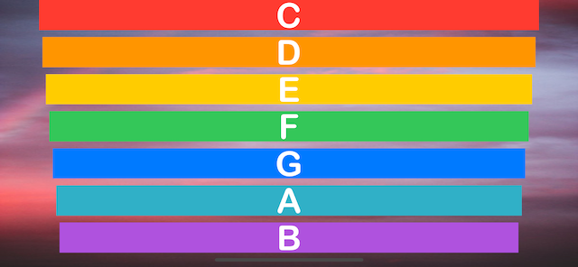

# Xylophone-IOS

## Description

A musical IOS application built using AVFoundation and AVAudioPlayer. This application was created to understand Apple Documentation and how to use StackOverflow. This application helps the user the following:

	- Functions and Methods in Swift
	- Data Types
	- Delay Code Exexcution In Swift
	- Multiple Object In One Function

## Technology Used

1. Xcode 13 - IDE
2. Swift 5 - Programming Language
3. UIKit - Interface Builder

## Sample Look

<h3>Portrait</h3>

<h3>Landscape</h3>

## Credits

<a href="https://www.flaticon.com/free-icons/xylophone" title="xylophone icons">Xylophone icons created by Freepik - Flaticon</a>

## Note
This is a companion project to The App Brewery's Complete App Development Bootcamp, check out the full course at [www.appbrewery.co](https://www.appbrewery.co/)
